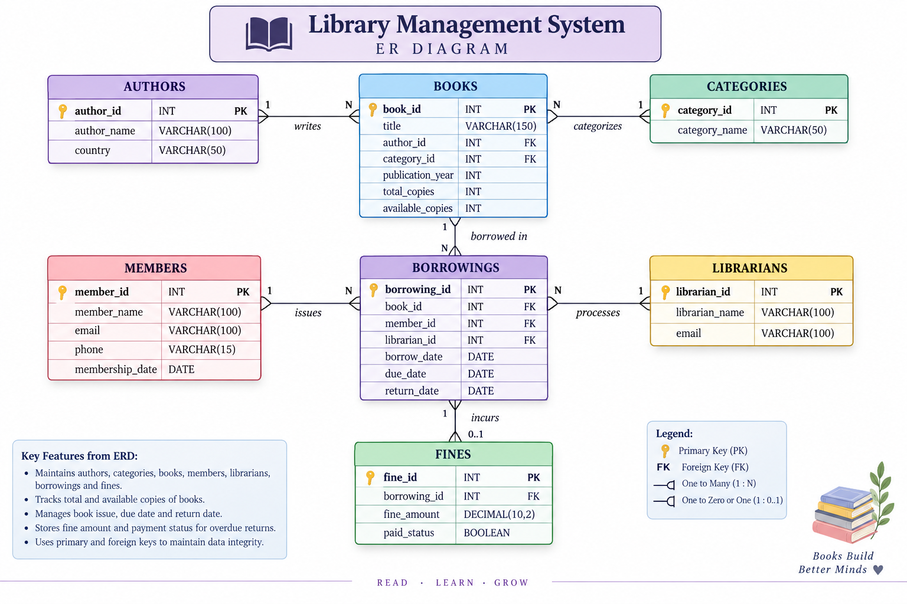

# 📚 Library Management System

A **MySQL-based Library Management System** designed to manage books, authors, categories, members, librarians, borrowings, and fines.
The project demonstrates practical SQL and database concepts including DDL, DML, filtering, aggregate functions, GROUP BY, HAVING, joins, single-row functions, subqueries, views, triggers, and stored procedures.

---

## 👩‍💻 Project Author

**Nikhitha Lade**  
GitHub: [@nikhithalade](https://github.com/nikhithalade)

---

## 📄 Project Documentation

* 📘 **Full Project Report**: [Download / View PROJECT_REPORT.docx](PROJECT_REPORT.docx) (Complete 20-section report covering system design, normalization, testing, and implementation).
---
## 🛠️ Technologies Used

- **MySQL** (Relational Database Management System)
- **SQL** (Structured Query Language)
- **MySQL Workbench** (GUI Development & Schema Design)
- **MySQL Command Line Client** (Command Line Execution)
  
---

## ✨ Features

- 📖 **Book Management**: Full catalog tracking with title, author, and category.
- ✍️ **Author Management**: Author details with nationality tracking.
- 🏷️ **Category Management**: Organized book classifications with unique genre constraints.
- 👤 **Member Management**: Patron registration with unique contact details.
- 👩‍💼 **Librarian Management**: Staff directory for processing transactions.
- 📚 **Circulation Tracking**: Tracks loan dates, due dates, and actual return dates.
- 📦 **Live Inventory Tracking**: Dual tracking of `total_copies` and `available_copies`.
- 💰 **Fine Accounting**: Automated linkage between late returns and fine payment status.
- 🔗 **Relational Operations**: Demonstrates INNER, LEFT, RIGHT, and CROSS JOINs.
- 👁️ **Database Views**: Pre-compiled virtual tables for reports.
- ⚙️ **Automated Triggers**: Auto-updates book stock on checkout, return, or deletion.
- 📦 **Stored Procedures**: Parameterized routines for fast lookups and registration.
  
---

## 🗃️ Database Tables

The system consists of **7 normalized tables**:
1. `authors` – Stores author identity and country.
2. `categories` – Stores distinct genres and classifications.
3. `books` – Stores catalog information, publication year, and inventory copy counts.
4. `members` – Stores registered library patrons and membership dates.
5. `librarians` – Stores staff details authorized to process transactions.
6. `borrowings` – Tracks book issue dates, due deadlines, and return timestamps.
7. `fines` – Tracks penalties incurred for overdue borrowings and payment statuses.

---

## 🔗 ER Diagram

  

---

## 🔎 SQL Concepts Demonstrated

- **DDL & DML**: `CREATE`, `ALTER`, `DROP`, `INSERT`, `UPDATE`, `DELETE`
- **WHERE Conditions**: Filtering with `BETWEEN`, `LIKE`, `IN`, `IS NULL`, `AND`, `OR`
- **Aggregate Functions**: `COUNT()`, `SUM()`, `AVG()`, `MIN()`, `MAX()`
- **Grouping**: `GROUP BY` and post-aggregation filtering with `HAVING`
- **Relational Joins**: `INNER JOIN`, `LEFT JOIN`, `RIGHT JOIN`, `CROSS JOIN`
- **Single-Row Functions**: `LOWER()`, `UPPER()`, `CONCAT()`, `TRIM()`, `LEFT()`, `SUBSTR()`, `LENGTH()`
- **Subqueries**: Scalar, multi-row (`IN`), and correlated (`EXISTS`) subqueries
- **Database Views**: Pre-filtered abstracted reporting tables
- **Triggers**: Engine-level automation on `INSERT`, `UPDATE`, and `DELETE`
- **Stored Procedures**: Parameterized reusable SQL routines
  
---

## 📁 Project Structure

Library-Management-System/

│

├── Database_and_Tables.sql             # Table creation, PKs, FKs, and constraints

├── Insert_records.sql                  # Comprehensive seed data (authors, books, members)

├── WHERE_statements.sql                # Data filtering and pattern matching queries

├── GROUPBY_and_AGGREGATE_functions.sql # Grouping and summary calculations

├── Joins.sql                           # Multi-table relational queries

├── Single_Row_Functions.sql            # String and scalar functions

├── Sub_Query_Statements.sql            # Nested and correlated subqueries

├── Triggers.sql                        # Event triggers for inventory automation

├── Stored_Procedure.sql                # Reusable procedures for operations

├── Views.sql                           # Reporting views

├── ERD.png                             # Entity-Relationship Diagram

├── PROJECT_REPORT.docx                 # Formal 20-section project documentation

├── LICENSE                             # MIT License

└── README.md                           # Documentation

## 📌 Project Summary

The Library Management System models a realistic library database ecosystem. By combining normalized schema design with MySQL triggers and stored procedures, it eliminates inventory anomalies and provides an automated, reliable foundation for library administration.

## ⭐ Support

If you find this project useful, consider giving the repository a ⭐!
